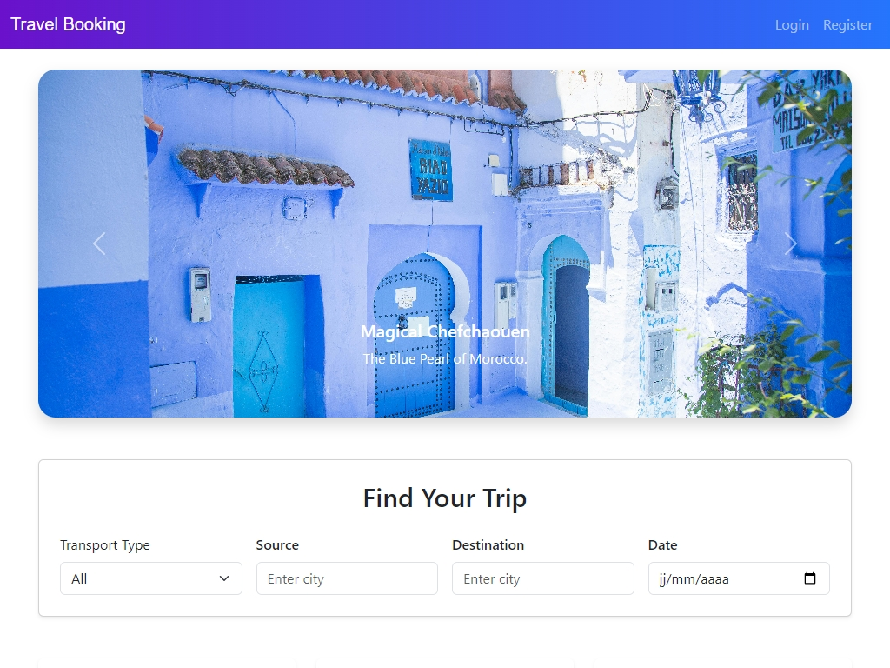
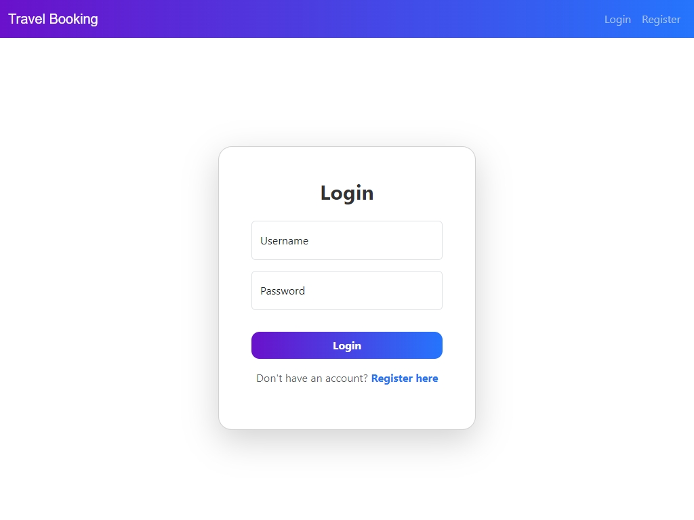
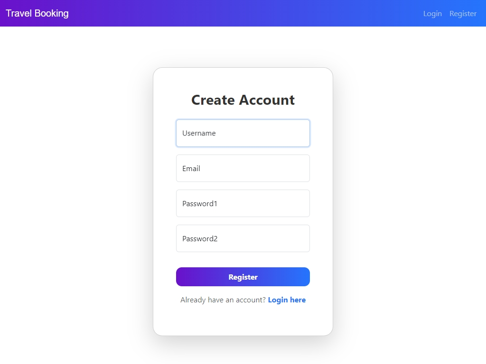
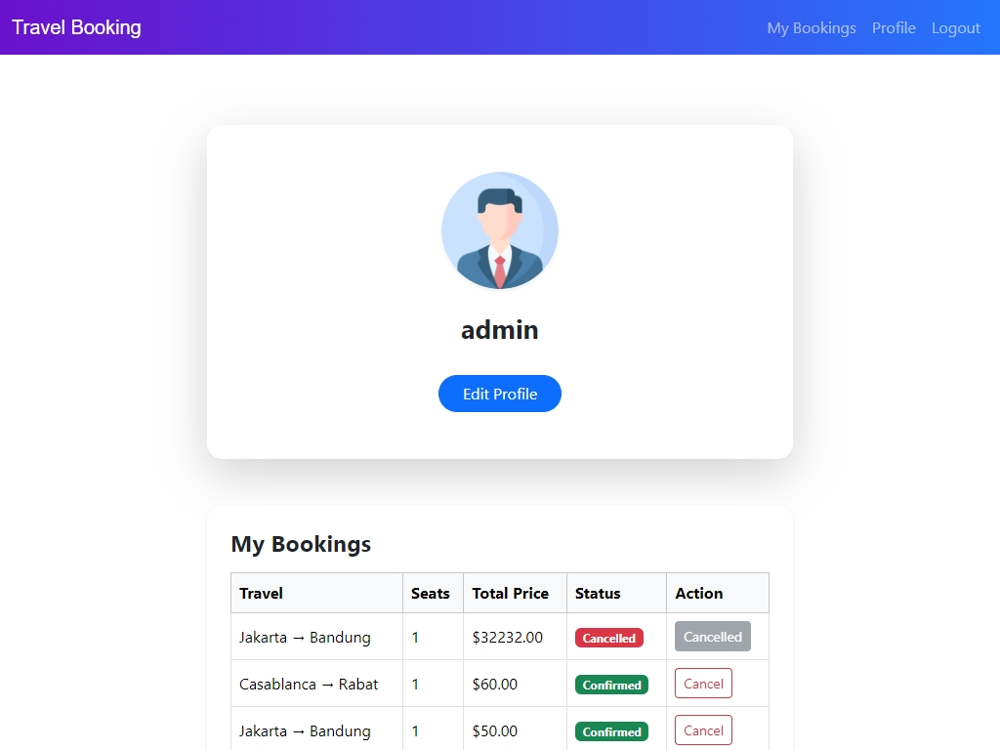
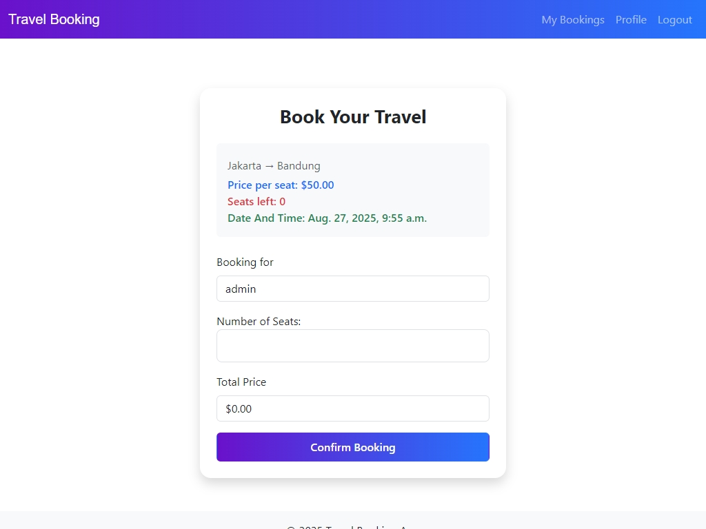
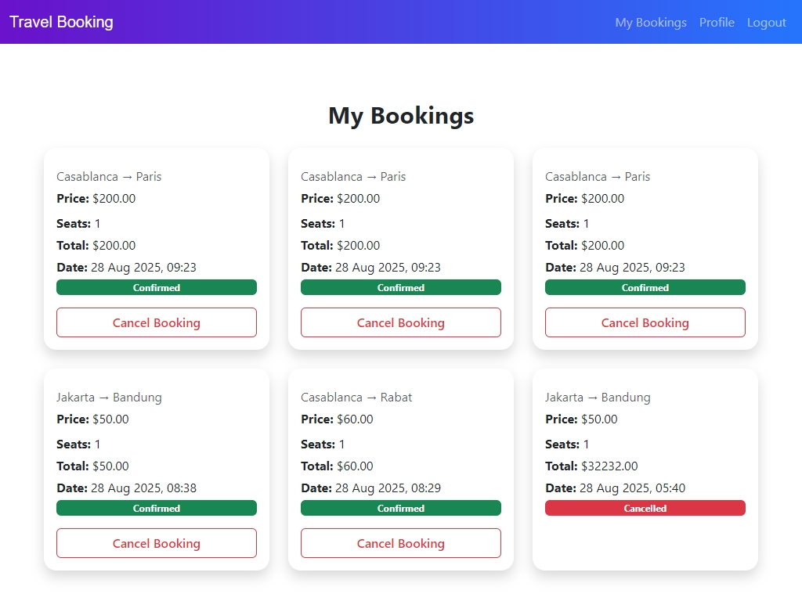
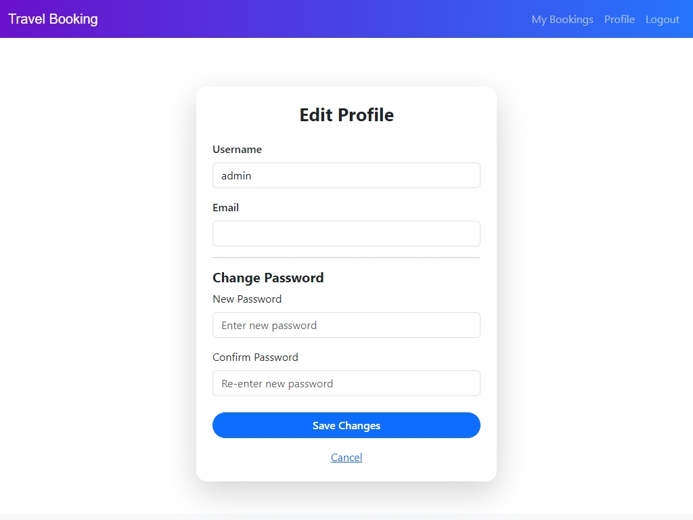

# Travel Booking Application

A modern travel booking web application built with **Django** that allows users to view, filter, and book travel options (flights, trains, buses).

---

## **Features**

- **User Management**
  - User registration, login, logout
  - Profile update

- **Travel Options**
  - Browse available travel options
  - Filter by type, source, destination, and date

- **Booking System**
  - Book trips with seat selection
  - View current and past bookings
  - Cancel bookings


- **Frontend**
  - Modern, responsive UI using Bootstrap
  - AJAX-powered search and filtering
  - Travel option cards and image slider

- **Database**
  - MySQL (XAMPP)
  - Data integrity enforced via Django models

- **Extras**
  - Unit tests for critical features
  - Error handling in login and booking
  - Dynamic display of travel types and options

---

## **Tech Stack**

- **Backend:** Python, Django  
- **Frontend:** HTML5, Bootstrap 5, JavaScript (AJAX)  
- **Database:** MySQL  
- **Deployment :** Render


## **Installation & Setup**

1. **Clone the repository**
```bash
git clone git@github.com:moatazbenma/Travel_booking_app.git
cd Travel_booking_app
```
2. **Create virtual environment**

        python -m venv venv
        venv\Scripts\activate   # Windows

3. **Install dependencies**

        pip install -r requirements.txt

4. **Configure MySQL**

- Create a database in XAMPP or MySQL:

        CREATE DATABASE travel_booking_db;

- Update settings.py DATABASES section with your credentials:

        DATABASES = {
            'default': {
                'ENGINE': 'django.db.backends.mysql',
                'NAME': 'travel_booking_db',
                'USER': 'root',
                'PASSWORD': '',
                'HOST': 'localhost',
                'PORT': '3306',
            }
        }


5. **Run migration**

        python manage.py makemigrations
        python manage.py migrate

6. **Create superuser**

        python manage.py createsuperuser

7. **Run the server**

        python manage.py runserver

## **Usage**

- Register or login as a user.

- Browse travel options from the home page.

- Filter trips by type, source, destination, or date.

- Click Book Now to reserve seats.

- Manage bookings from My Bookings page.

- Update your profile via Profile page.


## **Testing**
        python manage.py test travel_app


## **Folder Structure**

    Travel_booking_app/
    ├─ travel_app/
    │   ├─ migrations/
    │   ├─ templates/
    │   ├─ static/
    │   ├─ models.py
    │   ├─ views.py
    │   ├─ forms.py
    │   └─ tests.py
    ├─ travel_project/
    │   ├─ settings.py
    │   └─ urls.py
    ├─ manage.py
    ├─ requirements.txt
    └─ README.md

## **Screenshots**

**Home Page**


**Login**


**SignUp**


**Profile**


**Book**


**Bookings**


**Edit Profile**



## **License**
This project is open-source and available under the MIT License.